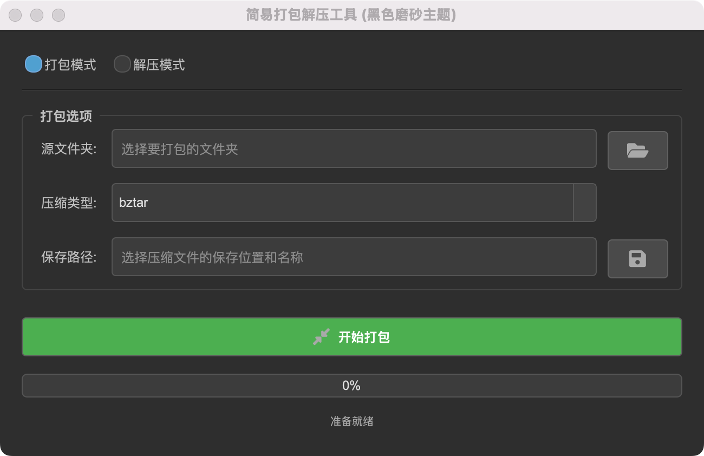

# ZipGUI - Simple Archive Utility

[](https://www.python.org/)
[](https://www.qt.io/qt-for-python)
[](LICENSE) <!-- 你可以添加一个 LICENSE 文件 -->

A clean and straightforward graphical interface for compressing (packing) and extracting (unpacking) archive files, built with Python and PySide6.

<div align="center">
  
</div>

## Overview

ZipGUI provides an intuitive user interface to manage your archive files effortlessly. 
Leveraging Python's built-in `shutil` module, it supports common archive formats like ZIP, TAR, GZ, BZ2, and XZ. 
Whether you need to quickly compress a folder or extract an archive, ZipGUI simplifies the process with visual feedback.

## ✨ Features

*   **Dual Mode Operation:** Easily switch between **Packing** (compressing files/folders) and **Unpacking** (extracting archives).
*   **Multiple Format Support:** Compresses to `zip`, `tar`, `gztar`, `bztar`, `xztar` formats.
*   **User-Friendly Interface:** Simple layout with clear options for selecting source paths, destination paths, and archive formats.

## 📋 Requirements

*   **Python:** 3.7 or higher
*   **PySide6:** The Qt for Python framework.

## 📦 Building Executable (Optional)

You can create a standalone executable using PyInstaller.

*   **Using the spec file (Recommended for more control):**
    Then build using the spec file:
    ```bash
    pyinstaller --clean ZipGUI.spec
    ```
*   **Simple one-file build:**
    ```bash
    pyinstaller --onefile --windowed --name="ZipGUI" app.py
    ```

The executable will be located in the `dist` folder.

## 🤝 Contributing

Contributions are welcome! If you have suggestions for improvements or find any bugs, please feel free to open an issue or submit a pull request.

1.  Fork the Project
2.  Create your Feature Branch (`git checkout -b feature/AmazingFeature`)
3.  Commit your Changes (`git commit -m 'Add some AmazingFeature'`)
4.  Push to the Branch (`git push origin feature/AmazingFeature`)
5.  Open a Pull Request

## 📄 License

Distributed under the MIT License. 